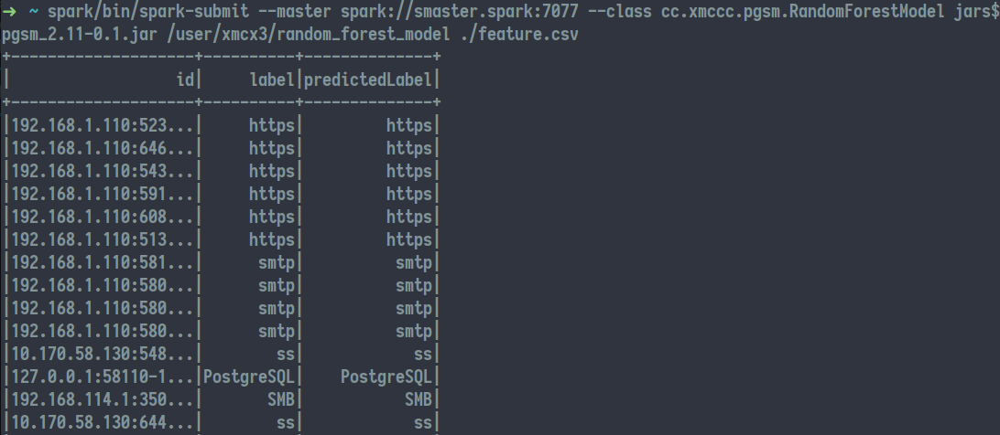

# PGSM
Precisely Guided Signature Matching of Deep Packet Inspection

### Introduction

This project proposes a new method called PGSM.
The PGSM aims to reduce the number of aimless matches which are useless and numerous in DPI and speed up the detection. 
At the same time, it is also compatible with other algorithm improvements.
We also submitted this program to [Globecom2019](https://globecom2019.ieee-globecom.org/).

In this project, we present the core code and a sample of PGSM. 
Due to the limitation of space, we randomly selected 16633 flow samples including 75 protocols from the huge data set we captured.
The results are shown as the figure.

### Requirements

We run the PGSM demo in the following environment:

* Spark 2.2.0
* HBase 1.3.1
* Hadoop 2.7.4
* JDK 8

Source code build with following dependency:

* Scala 2.11
* org.apache.spark % spark-core % 2.2.0
* org.apache.spark % spark-sql % 2.2.0
* org.apache.spark % spark-mllib % 2.2.0
* org.apache.hadoop % hadoop-common % 2.7.4

### Installation

1. Create a sbt project with following `build.sbt`


```sbt

name := "PGSM"

version := "0.1"

scalaVersion := "2.11.12"

val sparkVersion = "2.2.0"

libraryDependencies ++= Seq(
  "org.apache.spark" %% "spark-core" % sparkVersion  % Provided,
  "org.apache.spark" %% "spark-sql" % sparkVersion  % Provided ,
  "org.apache.spark" %% "spark-mllib" % sparkVersion % Provided ,
  "org.apache.hadoop" % "hadoop-common" % "2.7.4"
)

enablePlugins(PackPlugin)
```

and `plugins.sbt` (in `project/plugins.sbt` directory)

```sbt
addSbtPlugin("org.xerial.sbt" % "sbt-pack" % "0.11")
```
copy file `lib/usage/RandomForestModel.scala` to `src` file in the project root.

2. In the command line, use `sbt pack` to compile and package the Spark program.

### Usage

Before running the program, uploading the model file (in `examples/rules/random_forest_model`) to the HDFS with the command below.

```bash
hadoop fs -put random_forest_model
```

Use the command below to submit the program to Spark cluster.

```bash
spark-submit --master $SPARK_MASTER_ADDRESS --class cc.xmccc.pgsm.RandomForestModel jars/pgsm_2.11-0.1.jar $MODEL_FILES $FEATURE_FILE
```

### Example

Testing with model `examples/rules/random_forest_model` and featues `examples/features/features.csv`.



### Feedback
issues    

Email：cosey2yhn@gmail.com(General)  xmc2013v@gmail.com(Tech.)

### License

GNU General Public License
